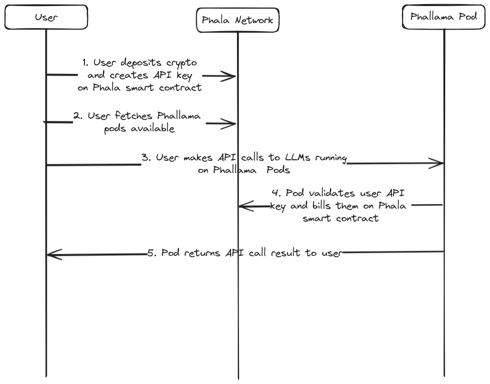

# Phallama

The centralization of AI models, in particular LLM chatbots and agents, is a huge risk for privacy. In a scenario where most of the population uses chatGPT or similar corporation provided services users are handling their personal data for those companies to use in the way they want.

Utilizing centralizing services is also detrimental to teh future of AI, as it increases funding and capability of private companies instead of fostering the development of open source and free AI technology.

Phallama is the solution for the problem. It creates a Decentralized Infrastructure running machines powered by SGX enclaves that serve request on open source LLM models. This allows anyone to access open source models without compromising any of their data and without having to own expensive hardware.

The network is to become fully decentralized and the cost of each query is going to be charged automatically through cryptocurrency.

## Architecture

There are 2 components in the protocol:
1. Phallama Pods - These are nodes that are going to be running Ollama inside SGX enclaves to provide queries to users

2. Phala network smart contracts - These are smart contracts running on Phala Network that coordinate Phallama pods and take care of billing for each query sent to Phallama Pods

Let's go through the application flow one by one:

1. User is going to create a keypair (public key and private key). The user then sends their public key and a token balance to the smart contract. The balance in the smart contract can be claimed by Phallama Pods that perform queries for the user;
2.  User searches the smart contract for information on the URL location of Phallama Pods providers and their SGX public encryption keys;
3. User selects on Phallama Node, encrypts their API call with their SGX public key (meaning only the SGX enclave is going to be able to read the message) and sends it to the Phallama Node;
4. The node makes a call to the Phala Smart contract to provide attestation of the API call and bill the user for it;
5. Phallama Pod returns the response of the API call to the user;

## Considerations

The architecture uses SGX enclaves because they make all computation that happens inside of them verifiable and private. This means no one can see the inputs that the user is providing to the LLM nor their API keys.
At the same time, verifiability allows the Phallama Pod to prove to the smart contract that it executed a valid query for the user and claim payment.

The architecture session described a simple private key exchange for billing, however in practice that is a more complex cryptographic operation to guarantee protection against replay attacks and gas efficient billing.

Phallama Pods can be run by anyone in possession of SGX enclaves. One can simply run the software at a cloud provider or build out their own infrastructure.

